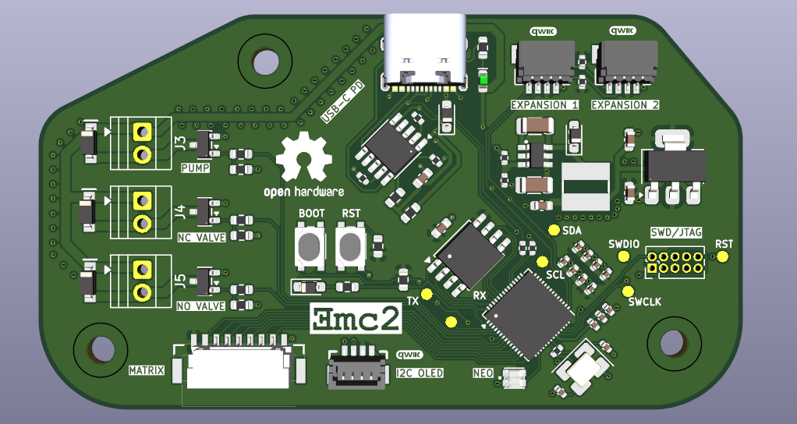

#   PickupPump- a Vacuum Pickup Tool for SMD Components (In Progress)

##  Brief

I was a big fan of the Pixel Pump project by Robbin's and loving the idea, but wanting to create my own version to better suit my needs, as well as allow me to design a circuit board of my own, I started working on my very own version. 

## Design Choices 

- RP2350 for the main mcu as it's a new and interesting chip from Raspberry Pi with a very solid SDK for built for both of the RP2X chips. 
- USB-C port for power & USB paired with a CH224K USB PD sink chip to request 12V for all of the motors/pumps and a switching converter to step-down the voltage for the mcu
- JST connector for connection to an additional PCB outfitted with a 3x2 array of pushbuttons, with each one having functions such as toggling the current suction state of the pump, increasing/decreasing suction strength, etc.
- There's 3 Sparkfun Qwiic/ Stemma Qt compatible JST connectors onboard to connect to an Adafruit I2C OLED as well as to allow for expansions (ie. footswitch)
- Onboard Cortex debug header for debugging & programming 
